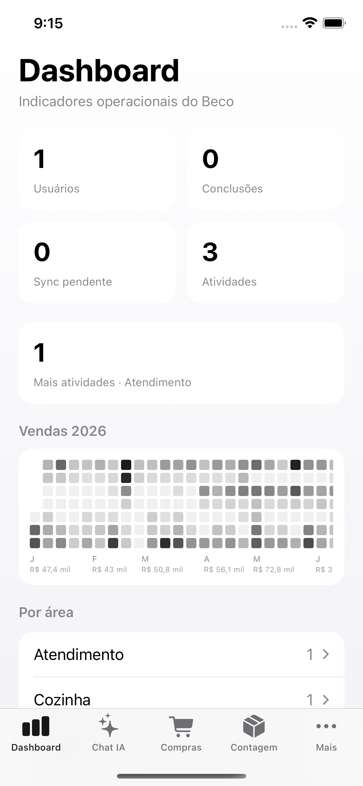
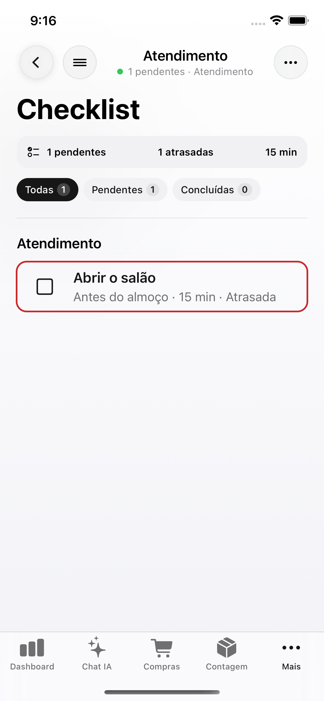
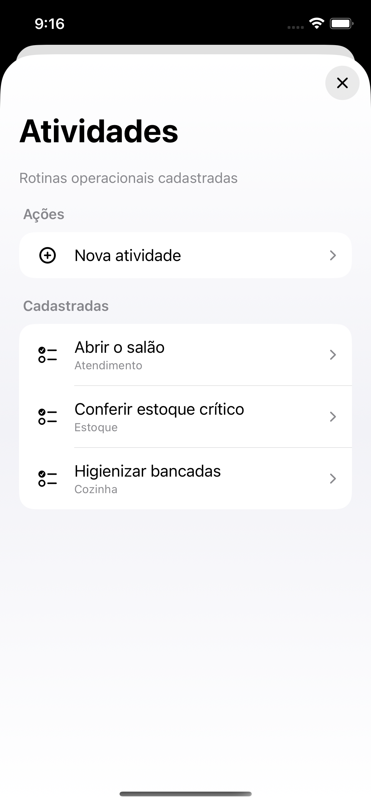
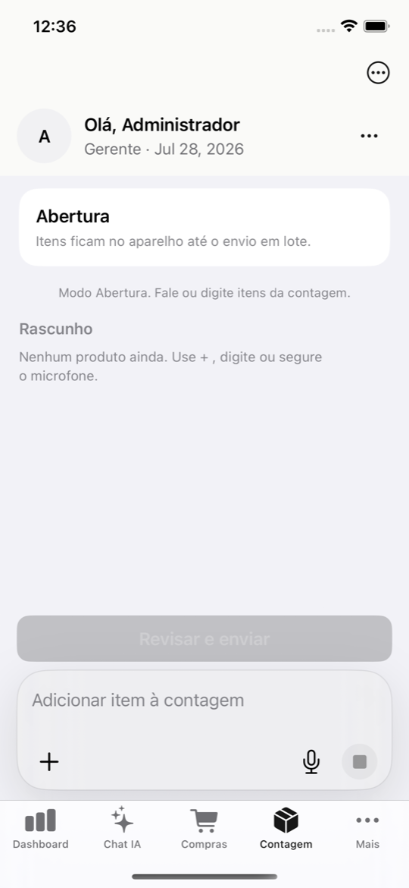
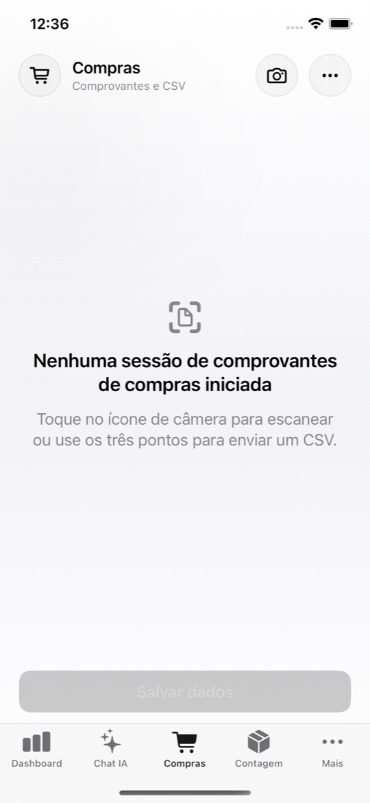

# Checklist Boteco

Sistema operacional leve para bares, restaurantes e botecos pequenos que querem sair da planilha e aproximar o dono dos dados reais da operação.

O projeto nasceu para o **Beco da Praia**, mas a proposta é clara: atender negócios pequenos, com 3 a 5 pessoas na operação, onde o dono ainda está perto do balcão, da equipe, do estoque e das vendas — só que sem precisar cruzar CSV, planilha, grupo de WhatsApp e caderno manual para entender o que está acontecendo.

Aqui, a ideia é que a IA consiga consultar os dados do negócio e responder em linguagem simples:

- “Quantas Heinekens vendemos em março?”
- “Quanto o João Rodrigues vendeu ontem no forró e quanto deu de 10%?”
- “Quem teve falta este mês?”
- “Houve extravio ou perda no estoque?”
- “O que ainda está pendente antes de abrir a casa?”

O dono continua no controle. A diferença é que ele pergunta para o sistema como perguntaria para uma pessoa da equipe.

## Visão do produto

O Checklist Boteco combina operação diária, dados importados e IA para transformar um bar pequeno em uma operação mais observável.

- **Apps mobile para a equipe:** checklist, ponto, contagem e rotinas do dia.
- **Painel web administrativo:** usuários, permissões, atividades, vendas, compras, auditoria e dashboards.
- **Backend serverless:** API REST, admin web, persistência e MCP no mesmo projeto Quarkus.
- **IA e MCP:** dados operacionais expostos de forma segura para chat e agentes de IA.
- **CSV sem sofrimento:** importação de relatórios de vendas/compras com mapeamento dinâmico e proteção contra duplicidade.

O objetivo não é criar um ERP pesado. É criar uma camada prática para o dono perguntar, auditar e decidir rápido.

## Produto em telas

Prints atuais do app iOS nativo (SwiftUI) — Dashboard com heatmap de vendas, Chat IA com resposta, Checklist, modal de Atividades, Contagem e Compras.

<table>
  <tr>
    <td align="center" width="33%">
      <br>
      <strong>iOS · Dashboard</strong><br>
      Heatmap de vendas, sync e resumo por área.
    </td>
    <td align="center" width="33%">
      <br>
      <strong>iOS · Chat IA</strong><br>
      Perguntas em linguagem natural sobre vendas, compras, estoque e ponto.
    </td>
    <td align="center" width="33%">
      <br>
      <strong>iOS · Checklist</strong><br>
      Rotina operacional por área com prazo e feedback visual.
    </td>
  </tr>
  <tr>
    <td align="center" width="33%">
      <br>
      <strong>iOS · Atividades</strong><br>
      Gestão de atividades em page sheet com chrome Codex.
    </td>
    <td align="center" width="33%">
      <br>
      <strong>iOS · Contagem</strong><br>
      Rascunho local com composer de texto/voz e envio em lote.
    </td>
    <td align="center" width="33%">
      <br>
      <strong>iOS · Compras</strong><br>
      Sessões de comprovantes (OCR) e importação CSV.
    </td>
  </tr>
</table>

Captura dos prints iOS (simulador): [`scripts/capture-readme-screenshots.sh`](scripts/capture-readme-screenshots.sh).

## O que o sistema faz hoje

### Operação diária

- Checklist por área e setor, com permissões por usuário.
- Checklist inteligente com prazo, duração estimada e feedback visual:
  - verde: dentro do prazo;
  - amarelo: próximo do limite;
  - vermelho: atrasado.
- Registro de conclusão com usuário, horário, data de serviço e atraso.
- Dashboard administrativo para acompanhar pendências, responsáveis e execução.

### Equipe e acesso

- Login com usuário e senha.
- Gestão de usuários no web admin.
- Criação, edição, remoção e reset de senha.
- Troca obrigatória de senha no primeiro acesso ou após reset.
- Permissões granulares para módulos administrativos.
- Tabs e módulos mobile liberados conforme permissões do usuário autenticado.

### Ponto de colaboradores

- Registro de entrada, almoço, descanso e saída.
- Botão de ponto habilitado somente com usuário logado, GPS permitido e dentro do raio configurado.
- Cálculo de jornada, saldo semanal, horas extras, descanso e faltas.
- Relatórios administrativos e exposição via MCP para consultas por IA.

### Compras, vendas e auditoria

- Importação CSV de compras/abastecimento.
- Importação CSV de vendas com mapeamento dinâmico.
- Deduplicação para uploads diários, semanais ou mensais sobrepostos.
- Preservação da data real da venda.
- Consulta por produto, período, local, vendedor/garçom e taxa de serviço de 10%.
- Auditoria de vendido × abastecido para identificar possíveis perdas, consumo sem registro, venda sem entrada correspondente ou extravio.

### Contagem e abastecimento

- Registro de contagem diária de bebidas, frutas porcionadas e mercadorias.
- Rascunho local antes do envio.
- Envio em lote para o backend com confirmação explícita.
- Sessões enviadas ficam imutáveis; exclusão apenas por admin.
- Auditoria diária com saldo teórico:

```text
saldo teórico = contagem de abertura - vendas do dia
```

### Chat IA

- Chat administrativo no iOS para consultar dados operacionais.
- A chave da OpenAI fica somente no backend.
- O app mobile não recebe chave da OpenAI nem token MCP.
- O backend limita contexto, tokens e ferramentas para reduzir custo.
- As ferramentas internas são somente leitura.

Mais detalhes: [docs/ai-chat.md](docs/ai-chat.md).

## IA e MCP: dados do Beco em linguagem natural

O servidor MCP `checklist-boteco-analytics` expõe os dados importados e operacionais para agentes como Codex, Cursor e outros clientes MCP.

Contexto fixo do projeto:

- `beco` significa **Beco da Praia**.
- Se o usuário não informar local, o sistema assume **Beco da Praia**.
- O MCP é somente leitura.
- O token MCP é separado do JWT de login.

Ferramentas disponíveis incluem:

- vendas por produto e período;
- vendas por vendedor/garçom e total de 10%;
- compras e abastecimento;
- auditoria vendido × abastecido;
- contagem e saldo teórico diário;
- resumo de ponto, horas extras, faltas e escala.

Configuração local pronta:

- Cursor: [.cursor/mcp.json](.cursor/mcp.json)
- Codex: [.codex/mcp.json](.codex/mcp.json)
- Guia completo: [docs/mcp-local-test.md](docs/mcp-local-test.md)
- Regras canônicas para agentes: [AGENTS.md](AGENTS.md)

## Arquitetura

```text
Android / iOS ──────────────┐
                            ├── REST API ── Quarkus ── LocalStore/DynamoDB
Web Admin Qute + JS ────────┤                 │
                            │                 ├── MCP analytics somente leitura
Cursor / Codex / agentes ───┘                 └── OpenAI Responses API
```

Em desenvolvimento, o backend roda localmente e persiste uploads confirmados de compras e vendas em arquivos JSON dentro de `backend/.data/`, mantendo os dados disponíveis após reiniciar o processo.

Em produção, o mesmo backend é publicado como Lambda com API Gateway HTTP API e DynamoDB.

## Stack técnica

### Backend e web admin

- Java 17
- Quarkus 3
- REST API
- Qute templates
- CSS e JavaScript vanilla, sem Node.js ou bundler
- Maven Wrapper
- AWS SAM
- AWS Lambda
- API Gateway HTTP API
- DynamoDB com billing `PAY_PER_REQUEST`
- MCP Streamable HTTP
- OpenAI Responses API

### Android

- Kotlin Multiplatform
- Compose / Material 3
- SQLDelight
- Coroutines e Flow
- Sincronização offline-first com backend Quarkus
- Permissões e navegação por perfil de usuário

### iOS

- SwiftUI nativo
- Swift Packages em `Packages/`
- GRDB / SQLite local
- Keychain
- UI própria alinhada ao design system mobile do projeto
- Chat IA administrativo

### Agentes de IA

- MCP local para Cursor/Codex
- Instruções centralizadas em [AGENTS.md](AGENTS.md)
- Regras de linguagem natural para vendas, compras, ponto, contagem e auditoria
- Acesso somente leitura aos dados operacionais

## Estrutura do projeto

```text
backend/
├── src/main/java/           # API, domínio, stores, segurança e MCP
├── src/main/resources/      # Qute, CSS, JS e configurações
├── pom.xml                  # Build do backend/admin web
└── template.yaml            # Lambda, HTTP API e DynamoDB via SAM

composeApp/
├── src/commonMain/          # Código compartilhado Android/Desktop
├── src/androidMain/         # Integrações Android
└── src/commonMain/sqldelight/

iosApp/
└── ChecklistBoteco/         # Shell SwiftUI nativo

Packages/
└── */                       # Features e módulos Swift Package

docs/
└── *.md                     # Guias técnicos por módulo
```

## Como rodar localmente

### Backend e web admin

Pré-requisito: JDK 17+.

```bash
cd backend
./mvnw quarkus:dev
```

Admin web local:

```text
http://localhost:8181
```

Credencial seed de desenvolvimento:

```text
admin@checklistboteco.com / admin123
```

Documentação completa: [docs/backend-deploy.md](docs/backend-deploy.md).

### Android

```bash
./gradlew :composeApp:installDebug -PCHECKLIST_API_BASE_URL=http://10.0.2.2:8181
```

`10.0.2.2` aponta o emulador Android para o backend rodando na máquina host. Builds fora dos hosts locais de desenvolvimento devem usar HTTPS.

Guia de sincronização: [docs/mobile-api-sync.md](docs/mobile-api-sync.md).

### iOS

Abra o projeto em Xcode:

```text
iosApp/ChecklistBoteco.xcodeproj
```

O app iOS é SwiftUI nativo e usa os packages locais em `Packages/`.

Guias:

- [docs/ios-app.md](docs/ios-app.md)
- [docs/ios-swiftui-standards.md](docs/ios-swiftui-standards.md)
- [docs/mobile-ui-ux-guidelines.md](docs/mobile-ui-ux-guidelines.md)

### MCP local

Com o backend rodando, use os arquivos prontos:

- [.cursor/mcp.json](.cursor/mcp.json)
- [.codex/mcp.json](.codex/mcp.json)

Guia de setup e perguntas de teste: [docs/mcp-local-test.md](docs/mcp-local-test.md).

## Deploy AWS

O backend é preparado para serverless:

- API Gateway HTTP API, com URLs limpas sem prefixo `/Prod`;
- Lambda Java 17 ARM64;
- DynamoDB criado automaticamente pelo SAM;
- billing `PAY_PER_REQUEST`;
- sem VPC, subnets ou security groups;
- tabelas separadas para operação, compras e vendas.

Fluxo base:

```bash
cd backend
./build-lambda.sh
sam build --template-file template.yaml
sam deploy --guided
```

Detalhes de parâmetros, segredos e produção: [docs/backend-deploy.md](docs/backend-deploy.md).

## Documentação principal

- [AGENTS.md](AGENTS.md) — regras canônicas para agentes de IA.
- [docs/ai-chat.md](docs/ai-chat.md) — chat IA, custos, segurança e OpenAI.
- [docs/mcp-local-test.md](docs/mcp-local-test.md) — configuração MCP para Cursor/Codex.
- [docs/backend-deploy.md](docs/backend-deploy.md) — backend, web admin e AWS.
- [docs/intelligent-checklist.md](docs/intelligent-checklist.md) — checklist com prazos e feedback visual.
- [docs/inventory-counting-module.md](docs/inventory-counting-module.md) — contagem e auditoria diária.
- [docs/sales-audit-module.md](docs/sales-audit-module.md) — vendas, CSV e auditoria.
- [docs/work-clock-module.md](docs/work-clock-module.md) — ponto, geofence, horas e faltas.
- [docs/mobile-api-sync.md](docs/mobile-api-sync.md) — sync mobile offline-first.
- [docs/release-v1-checklist.md](docs/release-v1-checklist.md) — checklist da primeira versão.

## Direcionamento para desenvolvimento com IA

Antes de implementar mudanças, siga [AGENTS.md](AGENTS.md).

Referências rápidas por domínio:

| Domínio | Referência |
| --- | --- |
| Backend, API, admin web e AWS | [.cursor/skills/quarkus-serverless-qute/SKILL.md](.cursor/skills/quarkus-serverless-qute/SKILL.md) |
| Arquitetura serverless | [docs/architecture-serverless.md](docs/architecture-serverless.md) |
| Android / Compose | [.cursor/skills/compose-ui-patterns/SKILL.md](.cursor/skills/compose-ui-patterns/SKILL.md) |
| iOS / SwiftUI | [.cursor/skills/swiftui-ui-patterns/SKILL.md](.cursor/skills/swiftui-ui-patterns/SKILL.md) |
| MCP e analytics | [docs/mcp-local-test.md](docs/mcp-local-test.md) |

Atalhos:

- Cursor: [.cursor/checklist-boteco-agent-instructions.md](.cursor/checklist-boteco-agent-instructions.md)
- Codex: [.codex/checklist-boteco-agent-instructions.md](.codex/checklist-boteco-agent-instructions.md)

## Segurança e dados sensíveis

- Não commitar `OPENAI_API_KEY`.
- Não commitar segredos AWS, JWT ou tokens de produção.
- Usar `backend/.env.local` apenas localmente.
- O Chat IA chama OpenAI pelo backend; apps mobile nunca recebem a chave.
- MCP local usa token próprio e acesso somente leitura.

## Estado do produto

Este é um MVP avançado orientado ao Beco da Praia, com arquitetura pensada para reaproveitamento em outros bares e restaurantes pequenos.

O foco é pragmático: menos sistema pesado, mais dado útil; menos planilha chata, mais pergunta direta; menos achismo na operação, mais decisão baseada no que realmente aconteceu no dia.
