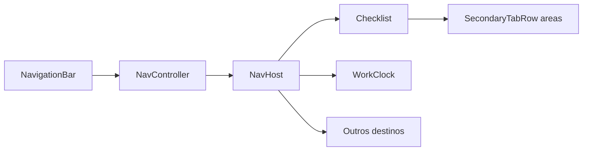

# Navegação Compose — Checklist Boteco

Padrão adotado para navegação principal no Android (KMP `composeApp/`).

## Decisão de arquitetura

| Camada | Componente Material 3 | Onde usamos |
|--------|----------------------|-------------|
| Destinos principais do app | `NavigationBar` + `NavigationBarItem` | `MainScreen` — Checklist, Ponto, Contagem, Dashboard, Atividades, Permissões |
| Agrupamento dentro de uma tela | `SecondaryTabRow` + `Tab` | `ChecklistScreen` — troca de área |
| Seções no topo (futuro) | `PrimaryTabRow` + `Tab` | Não usado na barra principal; reservado para sub-seções de uma mesma feature |

Referências oficiais:

- [Tabs (Compose)](https://developer.android.com/develop/ui/compose/components/tabs?hl=pt-br)
- [Navigation bar (Compose)](https://developer.android.com/develop/ui/compose/components/navigation-bar)

## Estrutura de arquivos

```
composeApp/src/commonMain/kotlin/com/checklistboteco/presentation/
  navigation/
    AppDestination.kt      # enum de rotas + availableFor(user)
    MainTabContext.kt      # dependências compartilhadas entre abas
    MainTabNavigation.kt   # navigateToTab() com saveState/restoreState
    MainNavGraph.kt        # NavHost + composable por destino
  screen/
    MainScreen.kt          # Scaffold + NavigationBar + NavHost
```

## Fluxo



1. `AppDestination.availableFor(user)` define abas visíveis por permissão.
2. `MainScreen` usa `rememberNavController()` e `currentBackStackEntryAsState()` para destacar a aba ativa.
3. `navigateToTab()` aplica o padrão Google: `popUpTo(start) { saveState = true }`, `launchSingleTop = true`, `restoreState = true`.
4. **Lazy load**: rotas só compõem conteúdo após a primeira visita (`loadedRoutes`), espelhando `loadedTabs` do iOS.
5. Telas-raiz de aba **não** exibem botão voltar para outra aba — troca de destino é pela `NavigationBar`.

## Snippet canônico — navegação entre abas

```kotlin
fun NavHostController.navigateToTab(destination: AppDestination) {
    navigate(destination.route) {
        popUpTo(graph.findStartDestination().id) {
            saveState = true
        }
        launchSingleTop = true
        restoreState = true
    }
}
```

## Snippet canônico — guias secundárias (áreas)

```kotlin
SecondaryTabRow(selectedTabIndex = selectedIndex) {
    accessibleAreas.forEachIndexed { index, area ->
        Tab(
            selected = selectedIndex == index,
            onClick = { viewModel.selectArea(area) },
            text = { Text(area.displayName) }
        )
    }
}
```

## Checklist de validação manual

- [ ] Admin vê 5–6 itens na barra inferior; colaborador vê apenas abas permitidas.
- [ ] Trocar de aba preserva estado ao retornar (scroll, seleções locais).
- [ ] Checklist com múltiplas áreas usa `SecondaryTabRow`.
- [ ] Dashboard, Atividades, Permissões e Ponto **não** têm seta voltar na raiz.
- [ ] Rotação de tela não perde aba selecionada (NavController `restoreState`).

## App bar moderna (Contagem)

A aba **Contagem** usa `ModernTopAppBar` (`presentation/components/ModernTopAppBar.kt`):

- `CenterAlignedTopAppBar` com `enterAlwaysScrollBehavior` e `Modifier.nestedScroll` no `Scaffold`.
- Ações secundárias (ex.: "Gerar auditoria") no menu overflow (`MoreVert`).
- FAB estendido para adicionar produto; CTA de envio no `bottomBar`.

Detalhes: [`.cursor/skills/compose-ui-patterns/references/app-bars.md`](../.cursor/skills/compose-ui-patterns/references/app-bars.md).

## Próximos incrementos

- `NavHost` aninhado por aba para detalhes (ex.: área no Dashboard, usuário em Permissões).
- Layout adaptativo: `NavigationRail` / `NavigationSuiteScaffold` em tablet e dobrável.
- `PrimaryTabRow` se uma feature precisar de sub-seções no topo (ex.: tipos de relatório).
- Rollout de `ModernTopAppBar` para Checklist, Dashboard e demais abas.

## Dependência

```kotlin
// composeApp/build.gradle.kts — commonMain
implementation(libs.navigation.compose)
```

Versão atual: `navigation-compose 2.8.0-alpha10` em `gradle/libs.versions.toml` (compatível com Kotlin 1.9.x do projeto).
