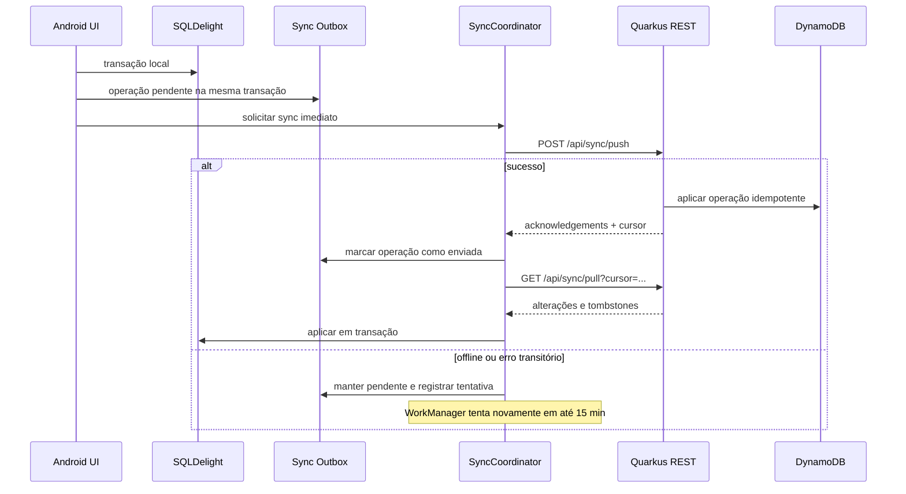

# Plano de sincronização Android ↔ Quarkus

## Objetivo

Conectar o app Android ao backend Quarkus por REST e manter atividades e conclusões sincronizadas sem perder a experiência offline. Toda inclusão, conclusão ou remoção é aplicada primeiro no banco local, enviada imediatamente quando houver rede e, se falhar, permanece em uma fila persistente para nova tentativa automática a cada 15 minutos.

## Estado atual relevante

- O app já usa Ktor Client, Kotlin Serialization e SQLDelight.
- `BackendApiClient` já implementa login, confirmação do dispositivo, health check e envio de ponto.
- O backend já possui `/api/sync/push` e `/api/sync/pull`, mas os contratos atuais ainda não representam corretamente atividades, conclusões, exclusões, idempotência ou conflitos.
- IDs locais são `Long` autoincrementais e IDs remotos são `String`. Isso precisa ser reconciliado antes da sincronização real.
- O token atual expira em 24 horas e não existe refresh token, o que impede sincronização prolongada em background.

## Princípios

- Local-first: a interface lê e grava somente o SQLDelight.
- Outbox persistente: nenhuma mutação depende de internet para ser aceita.
- Idempotência: repetir uma operação nunca duplica dados no servidor.
- Pull incremental: o app baixa somente alterações posteriores ao último cursor confirmado.
- Tombstones: exclusões são propagadas sem fazer registros antigos reaparecerem.
- Uma única sincronização por vez, protegida por mutex/lock.
- O worker não guarda senha; usa credenciais renováveis armazenadas com segurança.

## Fluxo



## Identidade das entidades

Adicionar um UUID estável gerado pelo cliente, usado local e remotamente:

- `Activity.syncId: String`
- `ActivityCompletion.syncId: String`
- `User.remoteId: String?`

O `id: Long` continua como chave interna do SQLDelight para não quebrar a UI atual. `syncId` recebe índice `UNIQUE` e passa a ser o identificador dos contratos REST.

## Alterações SQLDelight

Criar uma migração nova, sem recriar as tabelas:

```sql
ALTER TABLE Activity ADD COLUMN syncId TEXT;
ALTER TABLE Activity ADD COLUMN serverRevision INTEGER NOT NULL DEFAULT 0;
ALTER TABLE Activity ADD COLUMN syncState TEXT NOT NULL DEFAULT 'SYNCED';
ALTER TABLE Activity ADD COLUMN deletedAt INTEGER;

ALTER TABLE ActivityCompletion ADD COLUMN syncId TEXT;
ALTER TABLE ActivityCompletion ADD COLUMN serverRevision INTEGER NOT NULL DEFAULT 0;
ALTER TABLE ActivityCompletion ADD COLUMN syncState TEXT NOT NULL DEFAULT 'SYNCED';

CREATE TABLE SyncOutbox (
    operationId TEXT PRIMARY KEY,
    entityType TEXT NOT NULL,
    entitySyncId TEXT NOT NULL,
    operationType TEXT NOT NULL,
    payload TEXT NOT NULL,
    createdAt INTEGER NOT NULL,
    attemptCount INTEGER NOT NULL DEFAULT 0,
    nextAttemptAt INTEGER NOT NULL,
    lastError TEXT,
    status TEXT NOT NULL DEFAULT 'PENDING'
);

CREATE TABLE SyncMetadata (
    key TEXT PRIMARY KEY,
    value TEXT NOT NULL
);
```

Durante a migração, preencher `syncId` dos registros existentes com UUIDs e criar os índices únicos. Como SQL puro não gera UUID portável, o backfill deve ocorrer na inicialização Kotlin antes de ativar a sincronização.

## Operações da outbox

| Evento local | Operação | Payload |
|---|---|---|
| Criar atividade | `ACTIVITY_UPSERT` | Estado completo da atividade |
| Editar atividade | `ACTIVITY_UPSERT` | Estado completo e revisão conhecida |
| Remover atividade | `ACTIVITY_DELETE` | `syncId`, revisão e instante |
| Concluir atividade | `COMPLETION_CREATE` | Conclusão imutável e `activitySyncId` |

Cada método do repositório executa em uma única transação:

1. altera a tabela de domínio;
2. cria ou compacta a operação na `SyncOutbox`;
3. marca a entidade como `PENDING`;
4. retorna sucesso para a UI;
5. dispara uma tentativa assíncrona sem bloquear a tela.

Compactação recomendada:

- Vários `ACTIVITY_UPSERT` pendentes para o mesmo `syncId` viram somente o estado mais recente.
- `ACTIVITY_UPSERT` seguido de `ACTIVITY_DELETE` antes do primeiro envio pode ser removido localmente sem tráfego.
- Conclusões nunca são compactadas umas com as outras.

## Contrato REST proposto

### Push

```http
POST /api/sync/push
Authorization: Bearer <access-token>
Idempotency-Key: <batch-id>
Content-Type: application/json
```

```json
{
  "deviceId": "android-device-id",
  "operations": [
    {
      "operationId": "uuid",
      "type": "ACTIVITY_UPSERT",
      "entityId": "activity-uuid",
      "baseRevision": 3,
      "occurredAt": 1781790000000,
      "payload": {
        "name": "Conferir estoque",
        "area": "ESTOQUE",
        "frequency": "DIARIO",
        "effort": 2
      }
    }
  ]
}
```

Resposta:

```json
{
  "serverTime": 1781790010000,
  "cursor": "opaque-cursor",
  "acknowledgements": [
    { "operationId": "uuid", "status": "APPLIED", "serverRevision": 4 }
  ]
}
```

Status por operação: `APPLIED`, `ALREADY_APPLIED`, `CONFLICT`, `REJECTED`.

### Pull incremental

```http
GET /api/sync/pull?cursor=<opaque-cursor>&limit=500
Authorization: Bearer <access-token>
```

```json
{
  "nextCursor": "opaque-cursor",
  "hasMore": false,
  "activities": [],
  "completions": [],
  "tombstones": [
    { "entityType": "ACTIVITY", "entityId": "activity-uuid", "revision": 5 }
  ]
}
```

O cursor é opaco para o app e só é salvo após toda a página ser aplicada com sucesso no SQLDelight.

## Backend Quarkus

### Alterações necessárias

- Substituir os `List<String>` temporários do DTO Android por DTOs reais.
- Modelar `SyncOperation`, `SyncAcknowledgement`, `ServerChange` e `Tombstone`.
- Persistir `operationId` processado para idempotência.
- Atribuir `serverRevision` monotônica por entidade.
- Manter tombstones por período suficiente para cobrir dispositivos ausentes.
- Validar permissões: somente admin cria/remove atividades; usuário autenticado cria apenas suas próprias conclusões.
- Paginar o pull e nunca devolver todo o banco sem limite.
- Não confiar em `updatedAt` fornecido pelo cliente como ordenação global.
- Adicionar refresh token rotativo ou sessão de dispositivo renovável.

### Conflitos

- Atividade: controle otimista por `baseRevision`. Em conflito, servidor devolve a versão atual; o app preserva a operação e apresenta resolução ao admin.
- Conclusão: entidade imutável e idempotente por `syncId`; reenvio retorna `ALREADY_APPLIED`.
- Exclusão: vence atualizações com revisão anterior e gera tombstone.
- Relógio do cliente nunca decide qual versão é mais nova.

## App Android/KMP

### Componentes

```text
commonMain/
├── data/remote/SyncApiClient.kt
├── data/sync/SyncCoordinator.kt
├── data/sync/SyncOutboxRepository.kt
├── data/sync/SyncModels.kt
└── platform/SyncScheduler.kt          # expect

androidMain/
├── platform/SyncScheduler.android.kt  # WorkManager
└── data/sync/ChecklistSyncWorker.kt
```

`ChecklistRepository` passa a receber `SyncOutboxRepository` e registra cada mutação na mesma transação SQLDelight. ViewModels não chamam API diretamente.

### Agendamento Android

Usar WorkManager porque o intervalo mínimo oficial do trabalho periódico é 15 minutos:

```kotlin
val constraints = Constraints.Builder()
    .setRequiredNetworkType(NetworkType.CONNECTED)
    .build()

val periodic = PeriodicWorkRequestBuilder<ChecklistSyncWorker>(15, TimeUnit.MINUTES)
    .setConstraints(constraints)
    .setBackoffCriteria(BackoffPolicy.EXPONENTIAL, 30, TimeUnit.SECONDS)
    .build()

WorkManager.getInstance(context).enqueueUniquePeriodicWork(
    "checklist-sync",
    ExistingPeriodicWorkPolicy.KEEP,
    periodic
)
```

Além do periódico:

- agendar `OneTimeWorkRequest` após cada mutação local;
- agendar no login e na abertura do app;
- usar a mesma unique work/mutex para impedir concorrência;
- retornar `Result.retry()` para timeout, ausência de rede e HTTP `429`/`5xx`;
- retornar `Result.failure()` para payload inválido;
- pausar e exigir nova autenticação em `401` sem refresh possível.

O sistema operacional pode atrasar o periódico por bateria/Doze; “a cada 15 minutos” é uma frequência mínima solicitada, não um relógio exato. A tentativa imediata após a mutação reduz essa diferença.

## Ordem de uma sincronização

1. Obter lock.
2. Renovar access token se necessário.
3. Ler até 100 operações prontas da outbox.
4. Enviar o lote com `Idempotency-Key`.
5. Processar cada acknowledgement individualmente.
6. Marcar aplicadas como `SYNCED`; manter conflitos e erros transitórios.
7. Executar pull incremental até `hasMore = false`.
8. Aplicar atividades, conclusões e tombstones em transação.
9. Salvar o cursor.
10. Liberar lock e publicar o estado de sincronização para a UI.

## Imagens das conclusões

`imagePath` é um caminho local e não pode ser usado pelo backend. Antes de sincronizar fotos:

1. solicitar URL pré-assinada ao Quarkus;
2. enviar o arquivo diretamente ao S3;
3. incluir a chave remota na operação `COMPLETION_CREATE`;
4. manter a operação pendente até o upload terminar;
5. remover arquivos locais somente após confirmação e conforme retenção definida.

Até essa etapa existir, a conclusão pode sincronizar seus metadados, mas deve ser marcada como “imagem pendente”.

## Segurança

- Access token e refresh token no Android Keystore por meio de armazenamento seguro.
- HTTPS obrigatório fora de `localhost`, `127.0.0.1` e `10.0.2.2`.
- Refresh token vinculado ao dispositivo e revogável.
- Payloads limitados em tamanho e quantidade.
- Logs sem token, senha, caminho de foto ou conteúdo sensível.
- Logout revoga a sessão remota e cancela o trabalho periódico.

## Observabilidade da UI

Exibir discretamente:

- “Sincronizado”; 
- “3 alterações pendentes”; 
- “Última sincronização: 14:32”; 
- “Autenticação necessária”; 
- ação manual “Sincronizar agora”.

Falha de rede não desfaz a operação local nem bloqueia o usuário.

## Plano incremental

### Fase 0 — protocolo

- Fechar DTOs, permissões, conflitos, cursor e retenção de tombstones.
- Criar testes de contrato compartilhados entre Java e Kotlin.

### Fase 1 — IDs e outbox local

- Criar migração SQLDelight e backfill de UUIDs.
- Tornar inclusão, edição, conclusão e remoção transacionais com outbox.
- Testar compactação e sobrevivência após reiniciar o app.

### Fase 2 — backend idempotente

- Implementar push por operações, revisions, acknowledgements e tombstones.
- Implementar pull paginado por cursor.
- Cobrir reenvio, conflito, exclusão e permissão.

### Fase 3 — sincronização foreground

- Implementar `SyncApiClient` e `SyncCoordinator`.
- Sincronizar após login e após cada mutação.
- Exibir estado e ação manual.

### Fase 4 — background Android

- Adicionar WorkManager, trabalho único de 15 minutos e retry exponencial.
- Testar offline, retorno da rede, Doze e token expirado.

### Fase 5 — imagens e endurecimento

- Upload S3 pré-assinado e limpeza segura do cache.
- Métricas, limites, recuperação e testes com dois dispositivos.

## Critérios de aceite

- Criar, concluir ou remover atividade funciona imediatamente sem internet.
- A operação pendente sobrevive ao fechamento e reinício do app.
- O app tenta enviar imediatamente e agenda retry persistente.
- Com rede disponível, o worker tenta sincronizar no ciclo periódico de 15 minutos.
- Reenviar o mesmo lote não duplica atividade nem conclusão.
- Exclusão offline não reaparece após o pull.
- Dois dispositivos convergem para o mesmo estado ou apresentam conflito explícito.
- Usuário comum não consegue criar ou remover atividades administrativas.
- `401` não apaga operações; solicita reautenticação.
- Cursor só avança após aplicação local completa.

## Primeira fatia recomendada

Implementar primeiro IDs UUID + `SyncOutbox`, o novo `POST /api/sync/push` idempotente para `ACTIVITY_UPSERT` e uma tentativa manual em foreground. Depois que reenvio e conflitos estiverem comprovados, adicionar pull incremental e WorkManager. Essa ordem evita colocar um agendador confiável sobre um protocolo ainda ambíguo.
