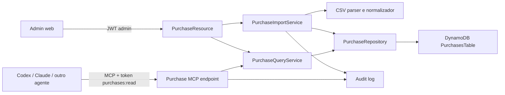

# Plano do módulo de compras com importação CSV e MCP

> Status: MVP implementado no backend Quarkus, administração web e template SAM. O modo de importação adotado é `APPEND` idempotente.

## Objetivo

Criar um módulo administrativo que importe arquivos CSV de compras de mercadorias, normalize e armazene os dados no DynamoDB e os exponha, somente para leitura, a agentes de IA por meio de MCP.

O primeiro ciclo não é um controle financeiro completo. Não haverá fluxo de caixa, receitas, contas a pagar, conciliação bancária ou chat dentro da aplicação. Codex, Claude, Cursor e outros agentes serão clientes do servidor MCP e usarão suas próprias capacidades de conversa.

## Escopo do MVP

### Incluído

- Acesso ao módulo web somente para usuários `ADMIN`.
- Upload de CSV com prévia e mapeamento de colunas.
- Importação idempotente de compras de mercadorias.
- Persistência dos campos principais e das colunas adicionais do arquivo.
- Tabela web dinâmica, paginada e ordenável.
- Filtros por período, categoria, fornecedor, mercadoria e atributos disponíveis no conjunto importado.
- Agregações de valor e quantidade por categoria, fornecedor, mercadoria, período ou atributo dinâmico.
- Servidor MCP remoto com ferramentas de consulta somente leitura.
- Auditoria de importações e chamadas MCP.

### Fora do MVP

- Cadastro manual ou edição de compras.
- Receitas, saldo, fluxo de caixa e contas a pagar/receber.
- Dashboard contábil, previsões ou recomendações automáticas.
- Chat ou dependência de OpenAI, Anthropic ou outro provedor no backend.
- Exportação, conciliação bancária e integrações com ERP.
- Ferramentas MCP de escrita.
- Acesso ao módulo por usuários comuns.

## Decisões principais

- O backend Quarkus continua sendo a autoridade sobre autenticação, filtros e dados.
- Valores monetários são armazenados em centavos (`long`), nunca em `double`.
- Datas da compra usam `LocalDate`; timestamps de importação e auditoria usam UTC.
- Os campos mais úteis são normalizados; colunas desconhecidas ficam em um mapa de atributos dinâmicos.
- O agente nunca acessa o DynamoDB diretamente. Ele chama ferramentas MCP com contratos limitados.
- Ferramentas MCP retornam dados paginados, filtros aplicados e metadados do esquema.
- O MVP não gera consultas arbitrárias. Filtros e agrupamentos são validados contra os campos disponíveis.
- Uma nova tabela DynamoDB de compras evita alterar a chave da tabela operacional existente.

## Arquitetura proposta



REST e MCP convergem em `PurchaseQueryService`. Assim, a tabela web e os agentes recebem os mesmos totais e obedecem às mesmas regras.

## Importação e tabelas dinâmicas

Arquivos de fornecedores ou ERPs podem usar nomes e quantidades de colunas diferentes. O importador separa os dados em dois grupos.

### Campos normalizados

Relatórios semanais podem conter título, mês, cabeçalhos repetidos, colunas vazias e linhas de totalização. A importação localiza o cabeçalho real, consolida as seções, preserva a semana como atributo dinâmico, infere o ano do título e ignora totais/subtotais.

| Campo | Obrigatório | Exemplos de origem |
|---|---:|---|
| `purchaseDate` | Sim | `data`, `emissão`, `dt_compra` |
| `description` | Não | `produto`, `mercadoria`, `descrição` |
| `totalInCents` | Sim | `total`, `valor_total` |
| `category` | Sim | `categoria`, `grupo`, `departamento` |
| `location` | Sim | `local`, `loja`, `estabelecimento` |
| `supplier` | Não | `fornecedor`, `razão_social` |
| `documentNumber` | Não | `nota`, `nf`, `documento` |
| `quantity` | Não | `quantidade`, `qtd` |
| `unit` | Não | `unidade`, `un` |
| `unitPriceInCents` | Não | `valor_unitário`, `preço` |

### Atributos dinâmicos

Toda coluna não mapeada para um campo normalizado pode ser preservada em `attributes`, por exemplo:

```json
{
  "brand": "Fornecedor A",
  "package": "Caixa com 12",
  "buyer": "Maria",
  "costCenter": "Cozinha"
}
```

Os nomes são convertidos para chaves estáveis (`snake_case` ou `camelCase`), enquanto o rótulo original é guardado no esquema da importação. O backend informa quais atributos existem e seus tipos inferidos para que a interface e os agentes montem filtros válidos.

### Fluxo de importação

1. Admin envia o CSV.
2. Backend detecta delimitador, encoding, cabeçalhos e tipos prováveis.
3. Interface apresenta amostra e sugere o mapeamento dos campos normalizados.
4. Admin corrige o mapeamento e escolhe quais colunas adicionais preservar.
5. Backend valida todas as linhas e apresenta erros antes da gravação.
6. Admin confirma a importação.
7. Backend grava o lote, o esquema e as compras válidas de forma idempotente.
8. Resultado informa linhas importadas, duplicadas e rejeitadas, com seus motivos.

O MVP usa importação síncrona com limites configuráveis de arquivo e linhas. Arquivos maiores poderão evoluir para S3, fila e worker sem mudar os contratos de consulta.

### Idempotência e atualização

- `fileHash` identifica reenvio do mesmo arquivo.
- `rowHash` identifica uma linha normalizada dentro de uma origem.
- A mesma linha não é duplicada ao importar novamente o mesmo conteúdo.
- Uma nova compra é acrescentada ao histórico.
- Correção de dados não sobrescreve silenciosamente uma compra anterior.

Há uma decisão de produto a fechar antes da implementação: quando um CSV representa um retrato completo de um período, a importação deve operar em modo `APPEND` ou `REPLACE_PERIOD`. Até essa decisão, o MVP assume `APPEND` idempotente, que é a opção mais segura contra perda de dados.

## Modelo de domínio

```java
public record Purchase(
    String id,
    String datasetId,
    LocalDate purchaseDate,
    String description,
    String category,
    String supplier,
    String documentNumber,
    BigDecimal quantity,
    String unit,
    long unitPriceInCents,
    long totalInCents,
    Map<String, Object> attributes,
    String importId,
    String rowHash,
    Instant importedAt
) {}
```

Entidades auxiliares:

- `PurchaseDataset`: conjunto lógico de dados, normalmente `purchases`.
- `ImportBatch`: arquivo, hash, autor, mapeamento, estado e contadores.
- `ImportSchema`: colunas, rótulos, tipos inferidos e campos normalizados.
- `PurchaseFilter`: período, categorias, fornecedores, texto e filtros dinâmicos.
- `PurchaseAggregation`: dimensões, métricas e resultados agrupados.
- `AuditEvent`: ator, operação, instante e resumo sem dados secretos.

## DynamoDB

Criar `PurchasesTable` separada da tabela atual da aplicação. Ela será criada automaticamente pelo SAM com `PAY_PER_REQUEST`, recuperação point-in-time e sem VPC.

Chaves propostas:

| Entidade | `pk` | `sk` |
|---|---|---|
| Compra | `DATASET#<datasetId>` | `PURCHASE#<yyyy-MM-dd>#<id>` |
| Lote | `IMPORT#<importId>` | `META` |
| Linha do lote | `IMPORT#<importId>` | `ROW#<rowHash>` |
| Esquema | `DATASET#<datasetId>` | `SCHEMA#<schemaId>` |
| Auditoria | `AUDIT#<yyyy-MM>` | `TIME#<instant>#<id>` |

Índices secundários devem cobrir somente dimensões normalizadas de alto uso, inicialmente categoria e fornecedor por data. Não é viável criar um índice para cada coluna dinâmica.

Para atributos dinâmicos, o MVP faz a consulta dentro de um período obrigatório e aplica os filtros no serviço, com limites de leitura e paginação. Se o volume tornar isso caro, a evolução será um índice de facetas materializado ou um mecanismo analítico dedicado; não uma proliferação de GSIs.

## Contrato REST inicial

Todas as rotas exigem JWT de administrador.

| Método | Rota | Uso |
|---|---|---|
| `POST` | `/api/purchases/imports/preview` | Analisa CSV e sugere mapeamento |
| `POST` | `/api/purchases/imports/{id}/commit` | Confirma a importação validada |
| `GET` | `/api/purchases/imports/{id}` | Consulta estado e erros do lote |
| `GET` | `/api/purchases/schema` | Lista campos normalizados e dinâmicos |
| `GET` | `/api/purchases` | Busca paginada e filtrada |
| `POST` | `/api/purchases/query` | Filtros dinâmicos complexos em JSON |
| `POST` | `/api/purchases/aggregate` | Totais e agrupamentos |

Exemplo de consulta dinâmica:

```json
{
  "from": "2026-06-01",
  "to": "2026-06-30",
  "categories": ["Bebidas"],
  "suppliers": ["Distribuidora A"],
  "text": "cerveja",
  "attributes": {
    "brand": { "operator": "EQUALS", "value": "Marca X" },
    "package": { "operator": "CONTAINS", "value": "12" }
  },
  "sort": [{ "field": "totalInCents", "direction": "DESC" }],
  "pageSize": 50
}
```

Operadores iniciais:

- Texto: `EQUALS`, `CONTAINS`, `STARTS_WITH`, `IN`.
- Número: `EQUALS`, `GT`, `GTE`, `LT`, `LTE`, `BETWEEN`.
- Data: `EQUALS`, `BEFORE`, `AFTER`, `BETWEEN`.

O backend rejeita campo ou operador que não conste no esquema inferido.

## Interface administrativa

```text
┌─────────────────────────────────────────────────────────────────────┐
│ Compras de mercadorias                              [Importar CSV]  │
├─────────────────────────────────────────────────────────────────────┤
│ Período  Categoria  Fornecedor  Mercadoria  [+ Outros filtros]     │
├─────────────────────────────────────────────────────────────────────┤
│ Total comprado: R$ 33.480,00   Itens: 842   Fornecedores: 17       │
├─────────────────────────────────────────────────────────────────────┤
│ Data │ Mercadoria │ Categoria │ Fornecedor │ Qtd │ Total │ ...     │
│ ...  │             colunas escolhidas dinamicamente            ... │
├─────────────────────────────────────────────────────────────────────┤
│ Página 1 de 12                                      50 por página  │
└─────────────────────────────────────────────────────────────────────┘
```

A interface usa `/api/purchases/schema` para criar colunas e filtros adicionais. Campos normalizados aparecem primeiro; atributos dinâmicos podem ser exibidos, ocultados e filtrados.

## MCP

O servidor MCP será uma camada fina sobre `PurchaseQueryService`, com transporte Streamable HTTP em endpoint dedicado, por exemplo `/mcp`. Os agentes usam tokens próprios, diferentes do JWT da interface.

### Ferramentas do MVP

| Tool | Finalidade |
|---|---|
| `purchases_get_schema` | Descobrir campos, atributos, tipos e operadores permitidos |
| `purchases_list` | Listar compras com filtros e paginação |
| `purchases_aggregate` | Somar valor/quantidade e agrupar por dimensões |
| `purchases_get_imports` | Consultar lotes importados e cobertura dos dados |

Exemplos que os agentes poderão responder combinando essas ferramentas:

- “Quanto foi comprado em abril?”
- “Quais categorias tiveram maior gasto no trimestre?”
- “Liste compras de bebidas do fornecedor X acima de R$ 500.”
- “Agrupe o total por marca”, quando `brand` existir no esquema.
- “Quais dados e períodos estão disponíveis?”

### Regras MCP

- Escopo obrigatório `purchases:read`.
- Período obrigatório para consultas de compras, salvo descoberta de esquema/importações.
- Limites de página, período e quantidade de grupos definidos no servidor.
- Nenhuma ferramenta aceita expressão de banco, PartiQL ou nome de índice.
- Respostas incluem filtros aplicados, paginação, moeda e período de cobertura.
- Toda chamada registra agente, tool, argumentos normalizados, duração e volume retornado.
- Nenhuma ferramenta cria, altera, exclui ou importa dados.

## Estrutura inicial de pacotes

```text
backend/src/main/java/com/checklistboteco/backend/purchases/
├── domain/
│   ├── Purchase.java
│   ├── PurchaseFilter.java
│   ├── ImportBatch.java
│   └── ImportSchema.java
├── application/
│   ├── PurchaseImportService.java
│   └── PurchaseQueryService.java
├── csv/
│   ├── CsvDetector.java
│   ├── CsvMapper.java
│   └── CsvValidator.java
├── persistence/
│   ├── PurchaseRepository.java
│   └── DynamoPurchaseRepository.java
├── mcp/
│   └── PurchaseMcpTools.java
├── web/
│   └── PurchaseResource.java
└── security/
    └── AdminPurchaseGuard.java
```

## Segurança e confiabilidade

- Extrair a validação administrativa atual para um guard ou filtro compartilhado.
- Conferir a permissão atual do usuário no store, permitindo revogação imediata.
- Validar tamanho, extensão, MIME, encoding, delimitador, número de colunas e linhas.
- Tratar conteúdo das células apenas como dados; nunca como instruções para agentes.
- Neutralizar fórmulas perigosas se futuramente houver exportação CSV.
- Não registrar conteúdo completo do arquivo, tokens ou dados sensíveis nos logs.
- Criptografar a tabela e qualquer arquivo original mantido por política de retenção.
- Aplicar rate limit e orçamento de leitura aos tokens MCP.
- Restringir CORS e proteger o endpoint MCP separadamente no API Gateway.

## Plano incremental

### Fase 0 — contrato e segurança

- Definir um CSV real de referência e os campos normalizados obrigatórios.
- Definir a semântica `APPEND` versus `REPLACE_PERIOD`.
- Extrair o guard administrativo e criar testes `401`, `403` e `200`.
- Adicionar a nova `PurchasesTable` ao SAM sem alterar a tabela existente.

### Fase 1 — importação

- Implementar detecção, prévia, mapeamento e validação.
- Persistir lote, esquema e compras com idempotência.
- Exibir relatório de importadas, duplicadas e rejeitadas.

### Fase 2 — consulta dinâmica

- Implementar esquema, filtros, ordenação e paginação.
- Criar tabela administrativa com colunas dinâmicas.
- Implementar agregações por campos normalizados e atributos permitidos.

### Fase 3 — MCP

- Expor as quatro tools somente leitura.
- Implementar token com escopo, auditoria e limites.
- Testar descoberta de esquema, filtros, agregações, paginação e acesso negado.
- Documentar a configuração para clientes MCP.

### Fase 4 — endurecimento

- Medir consumo DynamoDB com volumes reais.
- Adicionar índice de facetas apenas se as métricas justificarem.
- Definir retenção dos arquivos, recuperação e observabilidade.

## Critérios de aceite

- Usuário comum não vê o módulo e recebe `403` em todas as APIs de compras.
- Admin consegue mapear e validar um CSV antes de confirmar a importação.
- O mesmo conteúdo importado novamente não duplica compras.
- Cada linha rejeitada informa o campo e o motivo do erro.
- Colunas extras aparecem no esquema, na tabela e nos filtros compatíveis com seu tipo.
- Totais da interface e do MCP coincidem para os mesmos filtros.
- As tools MCP descobrem o esquema antes de consultar atributos dinâmicos.
- Consultas sem período ou acima dos limites são recusadas.
- Nenhuma tool MCP modifica dados.
- A tabela existente da aplicação não é substituída durante o deploy.

## Primeira fatia recomendada

Usar um CSV real para implementar verticalmente:

1. `POST /api/purchases/imports/preview`;
2. confirmação e persistência idempotente;
3. `GET /api/purchases/schema`;
4. `POST /api/purchases/query`;
5. uma tabela web somente leitura;
6. as tools MCP `purchases_get_schema` e `purchases_list`.

Essa fatia valida a parte mais incerta — variação das colunas — antes de investir em agregações e otimizações.
